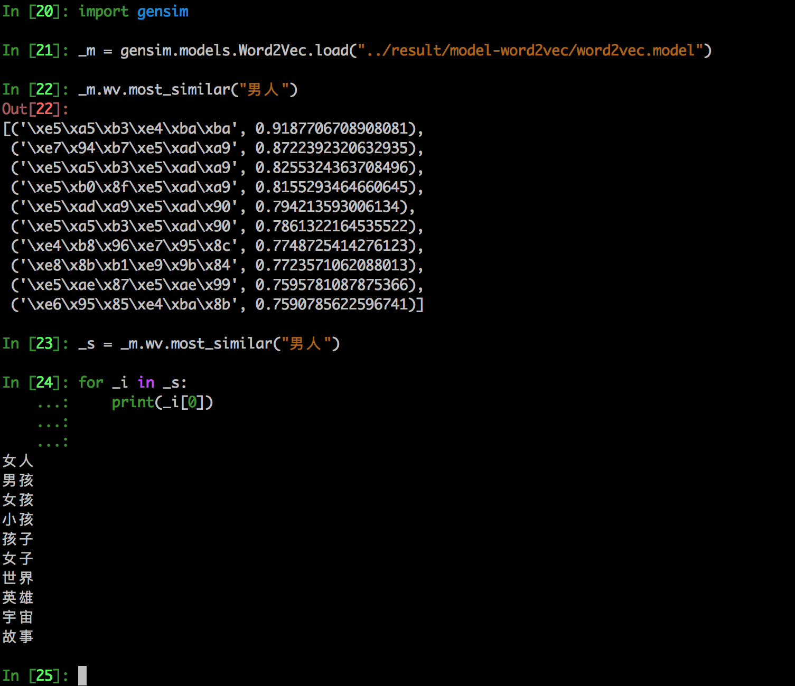

# subtitle

整个项目是想‘手动’撸一个对话机器人。

其中抓取视频字幕的想法来自 [shareditor](http://www.shareditor.com/blogshow?blogId=112)。但是他的程序 [ChatBotCourse](https://github.com/warmheartli/ChatBotCourse) 关于抓取部分已经不能工作，但思路还是来自于这位兄台。向您致敬！

这个项目抓取了一些电影的对话字幕，把对话的文字和过程作为语料。

抓到的字幕格式各种，后续做了一番处理。


* 文件名称全部 UUID 化，因为字幕文件名太长了，macOS 系统总报错，文件名字太长。（不知道怎么修？）

* 文件格式 DETECT，有一些需要解压缩，rar、zip、7z各种

* 文件编码统一成 UTF-8，几乎保留了所有语言的字幕 （有些编码好像略去了，可能是滚动太快，没看见）

* 生成中间文件，以便随时可以从任意一个阶段开始


> 抓字幕要克制，不然字幕网站来砍我！ 若想研究学习大家可以直接留言要最终的语料，不用自己去刮了。本项目纯属个人研究学习，不要用于商业目的！！！。

### 测试链接

[机器人测试链接](https://wanda.ppmessage.cn/ppcom/enterprise/eyJ1dWlkIjoiZTBhM2Q4MTYtZGJiMy0xMWU3LWE0MTctMDAxNjNlMDA2ZGViIiwiYXBwX25hbWUiOiJQUE1FU1NBR0UifQ==)，同学们，快快去撩，^_^。

其中聊天界面骄傲➕自豪的使用了 [PPMESSAGE - PLUG AND PLAY MESSAGE](https://ppmessage.cn)

### 开始抓取

下载代码：

```shell

git clone https://github.com/dingguijin/subtitle.git

cd subtitle

cd scrapy_project

scrapy crawl subtitle

```

> 如果你没有装 scrapy，要执行 pip install scrapy 命令以安装 scrapy 先。全部字幕抓下来近 13G，解压缩后 36G，刨除一些无法处理的文件转成 utf8 后，31G。代码中做了限制没有全部抓取，要低调，反正是玩玩，不要赶尽杀绝哟。


### 清洗文件

> 抓取下来的文件放在 subtitle/scrapy_project/result/raw 下面，result 下面还有 unzip utf8 这样的文件夹，都是清洗过程产生的中间文件


#### 解压缩

> 不要安装 filemagic，而是 python-magic，pip install python-magic


```

cd subtitle/scrapy_project/cleaning

python unzip-files.py

```

> 解压缩出来的文件会放在 result/unzip 目录下面


#### 转码

```

cd subtitle/scrapy_project/cleaning

python convert-utf8.py

```

> 解压缩出来的文件会放在 result/utf8 目录下面


#### 辨别可以提取对话数据的文件

```

cd subtitle/scrapy_project/cleaning

python extract-dialogue.py

```

> 可以识别的对话数据放在 result/extracted 目录下面，


#### 提取句子

```

cd subtitle/scrapy_project/cleaning

python extract-sentence.py

```

> 句子在 result/sentence 目录下面，


### 分词

```

cd subtitle/scrapy_project/cleaning

python token-jieba.py

```

> 刚开始用 token.py 结果jieba导入不进来，原来token名字冲突了，千万别叫简单的名字，越丑越好，省的和别人冲突


### 词嵌入 （word2vec 使用 GENSIM）

```

cd subtitle/scrapy_project/cleaning

python word2vec-gensim.py

```

> 生成的模型在 result/model 下面，GENSIM （GENERATE SIMILAR）


### 试试 word2vec 的 model



### 训练

```
cd seq2seq

python seq2seq.py
```

这里使用了 Pytorch，应用了它的 Tutorial 中的 SEQ2SEQ 的例子。以前例子是翻译，这里变成对话，没毛病。


## 未完